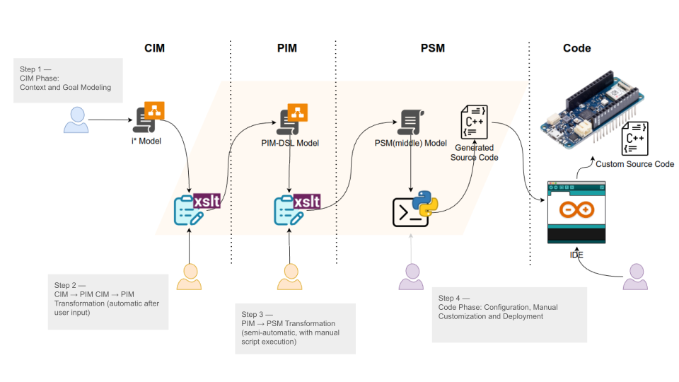
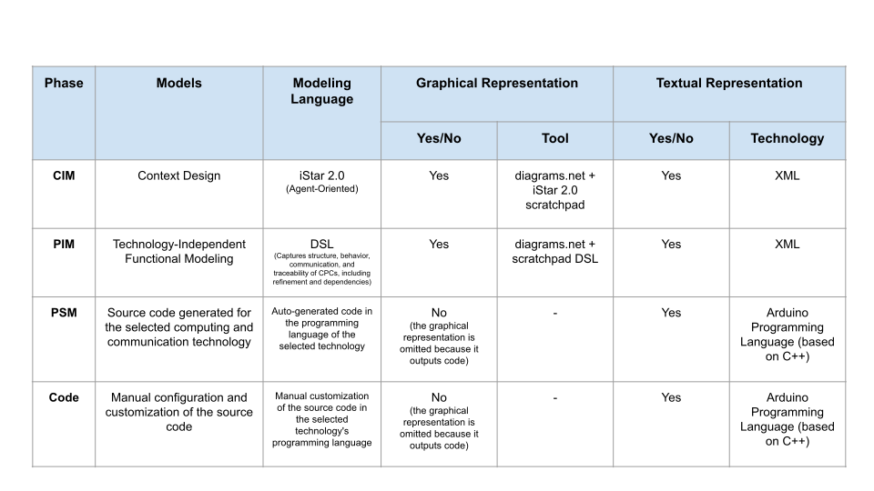

# Overview of the Agent-Oriented MDD Process for CPS Development
The figure below provides an overview of the agent-oriented Model-Driven Development (MDD) process applied to Cyber-Physical System (CPS) development. It illustrates the four main phases—CIM, PIM, PSM, and Code—highlighting the tools used, transformation flow, and designer interactions at each step.

### Step 1 — CIM Phase: Context and Goal Modeling

The designer defines the CPS context and goals using the iStar 2.0 library within diagrams.net, producing a CIM model that captures the system’s intentions and agent interactions.

---

### Step 2 — CIM → PIM Transformation (automated post-input)

The designer launches the transformation through a web interface. A Flask-based frontend prompts the user with a questionnaire to gather technology-independent design details. Once the input is submitted, the backend (powered by XSLT) automatically generates the PIM model, using a DSL that describes functional, structural, and behavioral aspects of the CPS.

---

### Step 3 — PIM → PSM Transformation (requires script execution)

Optionally, the PIM model may be refined using diagrams.net with the DSL library. Then, the designer completes a second web questionnaire to capture platform-specific information. This input is used to generate an intermediate PSM model. At this point, the designer manually executes a Python script to transform the PSM model into platform-specific source code. While this step is simple, it is not yet fully automated.

---

### Step 4 — Code Phase: Configuration, Manual Customization and Deployment

The generated source code is adapted to the deployment environment in three steps. First, configuration parameters such as WiFi credentials and hardware pin assignments are set. Then, manual customization may be required—for example, adding logic to support specific operation modes. Finally, the adjusted code is deployed to the target hardware (e.g., Arduino MKR WiFi 1010) using the Arduino IDE, completing the development cycle.

# Technologies and Tools per Modeling Phase
The following table summarizes the technologies and tools used across each modeling phase of the proposed MDD process. It highlights the type of models, languages, and the availability of graphical and textual representations at each stage.

